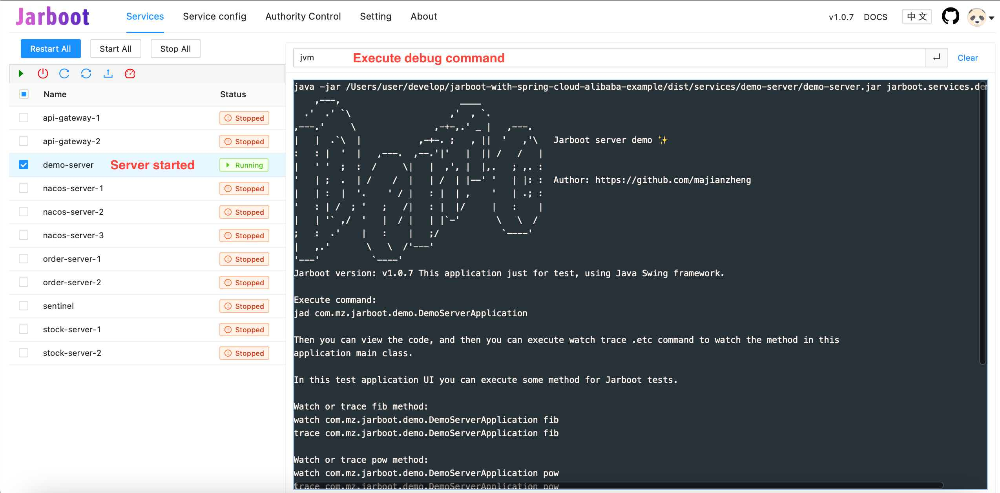
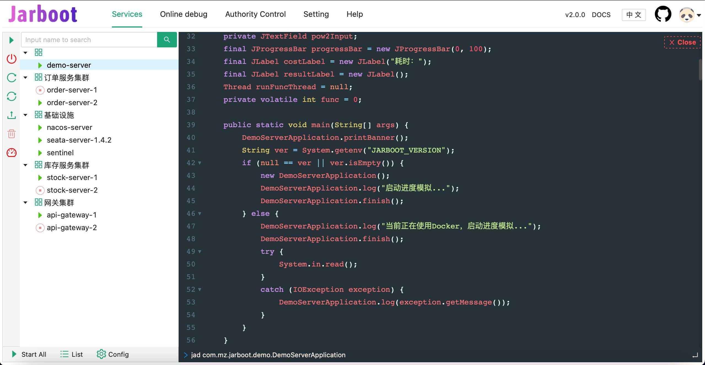

# Jarboot ❤️


[](https://travis-ci.com/majianzheng/jarboot)
[](https://codecov.io/gh/majianzheng/jarboot)

<code>Jarboot</code> 是一个Java进程启动器，可以管理、监控及调试一系列的Java进程。

在测试环境、每日构建的集成环境，可以把一系列编译输出等jar文件放入约定的目录，由<code>Jarboot</code>提供友好的浏览器ui界面和<code>http</code>接口，统一管理它的启动、停止及状态的监控，以及执行命令对目标进程进行调试。

English version goes [here](README.md).



## 技术背景及目标
<code>Jarboot</code> 使用<code>Java Agent</code>和<code>ASM</code>技术往目标Java进程注入代码，无业务侵入性，注入的代码仅用于和<code>Jarboot</code> 的服务实现命令交互，部分命令会修改类的字节码用于类增强，加入了与<code>Arthas</code>类似的命令系统，如获取JVM信息、监控线程状态、获取线程栈信息等。但它的功能定位与<code>Arthas</code>不同，<code>Jarboot</code> 更偏向于面向开发、测试、每日构建等。

- 🌈   浏览器界面管理，一键启、停服务进程，不必挨个手动执行
- 🔥   支持启动、停止优先级配置<sup id="a2">[[1]](#f1)</sup>，默认并行启动
- ⭐️支持进程守护，开启后若服务异常退出则自动启动并通知
- ☀️支持文件更新监控，开启后若jar文件更新则自动重启<sup id="a3">[[2]](#f2)</sup>
- 🚀   调试命令执行，同时远程调试多个Java进程，界面更友好

采用<code>前后端分离</code>架构，前端界面采用<code>React</code>技术，脚手架使用<code>Umi</code>，组件库使用Umi内置等<code>antd</code>。后端服务主要由<code>SpringBoot</code>实现，提供http接口和静态资源代理。通过<code>WebSocket</code>向前端界面实时推送进程信息，同时与启动的Java进程维持一个长连接，以监控其状态。

## 安装或编译构建
1. 编译前端项目和java，或者下载发布的zip安装包
```bash
cd jarboot-ui
//首次时需要先安装依赖，执行yarn或npm install
yarn

//执行编译，yarn buld或npm run build，开发模式可执行yarn start或npm run start
yarn build

//切换到代码根目录，编译Java代码
mvn clean install
```

2. 安装后的目录结构

```bash
jarboot                             //当前工作目录
├─logs                              //日志
├─jarboot-spy.jar
├─jarboot-agent.jar                 
├─jarboot-core.jar                  
├─jarboot-service.jar               //Web服务HTTP接口及WebSocket及主要业务实现
│
├─services                          //约定的管理其他jar文件的默认根目录(可配置)
│  ├─demo1-service                  //服务名为目录, 目录下存放启动的jar文件及其依赖
│  │   └─demo1-service.jar          //启动的jar文件, 若有多个则需要在[服务配置]界面配置启动的jar文件, 否则可能会随机选择一个
│  └─demo2-service                  
│      └─demo2-service.jar
└─static                            //前端界面资源位置
   ├─index.html                     
   ├─umi.css                        
   └─umi.js                         
```
后端服务启动会指定一个管理其他启动jar文件的根路径（默认为当前路径下的services，可在【服务配置】界面配置），在此根目录下创建每个服务目录，创建的 ***目录名字为服务名*** ，在创建的目录下放入jar包文件，详细可见上面的目录结构约定。

3. 启动<code>jarboot-service.jar</code>主控服务
```
./boot.sh
```

4. 浏览器访问<http://127.0.0.1:9899>

## 命令列表
- bytes 查看类的字节码，用法：
```bash
$ bytes com.mz.jarboot.demo.DemoServerApplication
ClassLoader: org.springframework.boot.loader.LaunchedURLClassLoader@31221be2
------
getUser
L0
LINENUMBER 27 L0

...

ILOAD 1
ILOAD 2
IADD
IRETURN
L8
```
  
- dashboard 当前系统的实时数据面板，点击按钮取消


  
- jad 反编译
```bash
$ jad [-c] java.lang.String
````


- jvm 查看进程JVM属性信息
```bash
$ jvm
````
  
- trace 方法执行监控 
```bash
$ trace com.mz.jarboot.demo.DemoServerApplication add 
Affect(class count: 2 , method count: 1) cost in 63 ms, listenerId: 2
`---ts=2021-06-15 23:34:20;thread_name=http-nio-9900-exec-3;id=13;is_daemon=true;priority=5;TCCL=org.springframework.boot.web.embedded.tomcat.TomcatEmbeddedWebappClassLoader@4690b489
    `---[0.053485ms] com.mz.jarboot.demo.DemoServerApplication:add()
```
  
- watch 方法执行数据监测
    
观察方法 `test.arthas.TestWatch#doGet` 执行的入参，仅当方法抛出异常时才输出。

```bash
$ watch test.arthas.TestWatch doGet {params[0], throwExp} -e
Press Ctrl+C to abort.
Affect(class-cnt:1 , method-cnt:1) cost in 65 ms.
ts=2018-09-18 10:26:28;result=@ArrayList[
    @RequestFacade[org.apache.catalina.connector.RequestFacade@79f922b2],
    @NullPointerException[java.lang.NullPointerException],
]
```
  
- thread 查看当前线程信息，查看线程的堆栈
```bash
$ thread -n 3
"as-command-execute-daemon" Id=29 cpuUsage=75% RUNNABLE
    at sun.management.ThreadImpl.dumpThreads0(Native Method)
    at sun.management.ThreadImpl.getThreadInfo(ThreadImpl.java:440)
    at com.taobao.arthas.core.command.monitor200.ThreadCommand$1.action(ThreadCommand.java:58)
    at com.taobao.arthas.core.command.handler.AbstractCommandHandler.execute(AbstractCommandHandler.java:238)
    at com.taobao.arthas.core.command.handler.DefaultCommandHandler.handleCommand(DefaultCommandHandler.java:67)
    at com.taobao.arthas.core.server.ArthasServer$4.run(ArthasServer.java:276)
    at java.util.concurrent.ThreadPoolExecutor.runWorker(ThreadPoolExecutor.java:1145)
    at java.util.concurrent.ThreadPoolExecutor$Worker.run(ThreadPoolExecutor.java:615)
    at java.lang.Thread.run(Thread.java:745)

    Number of locked synchronizers = 1
    - java.util.concurrent.ThreadPoolExecutor$Worker@6cd0b6f8

"as-session-expire-daemon" Id=25 cpuUsage=24% TIMED_WAITING
    at java.lang.Thread.sleep(Native Method)
    at com.taobao.arthas.core.server.DefaultSessionManager$2.run(DefaultSessionManager.java:85)

"Reference Handler" Id=2 cpuUsage=0% WAITING on java.lang.ref.Reference$Lock@69ba0f27
    at java.lang.Object.wait(Native Method)
    -  waiting on java.lang.ref.Reference$Lock@69ba0f27
    at java.lang.Object.wait(Object.java:503)
    at java.lang.ref.Reference$ReferenceHandler.run(Reference.java:133)
```

- sysprop 查看进程系统属性信息
```bash
$ sysprop
sysprop user.home
```
  
- 更多强大的指令在持续开发中...

#### Projects

* [bytekit](https://github.com/alibaba/bytekit) Java Bytecode Kit.
* [Arthas](https://github.com/alibaba/arthas) Arthas，部分命令在<code>Arthas</code>源码的基础上二次开发。

### 仓库镜像

* [码云Jarboot](https://gitee.com/majz0908/jarboot)

---
<span id="f1">1[](#a1)</span>: 可以配置优先级级别，从整数值1开始，越大约先启动，停止的顺序则相反，默认为1。<br>
<span id="f2">2[](#a2)</span>: 开发中可以由<code>gitlab runner</code>、<code>Jenkins</code>等工具自动构建后通过脚本拷贝到Jarboot指定的目录下，Jarboot监控到文件的更新会自动重启服务，目录监控实现了<code>防抖设计</code>（在一定时间内的多次更新只会触发一次重启）。
